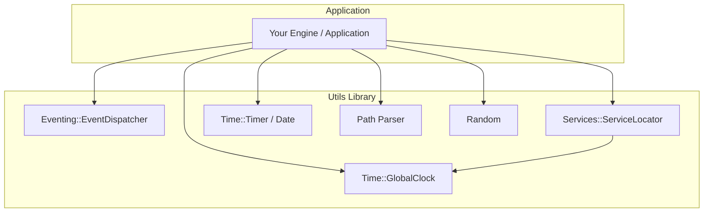

# Utils

A modern C++23 shared library of cross-cutting utilities for game engines and graphics applications. Utils provides event dispatching, dependency injection, timing, path helpers, and small foundational types — designed to be linked into any engine module that needs them.

---

## Table of Contents

- [Architecture](#architecture)
- [Requirements](#requirements)
- [Getting Started](#getting-started)
  - [1. Configure the Project](#1-configure-the-project)
  - [2. Build the Library](#2-build-the-library)
  - [3. Run Tests](#3-run-tests)
- [Usage](#usage)
  - [Event Dispatching](#event-dispatching)
  - [Service Locator](#service-locator)
  - [Timing](#timing)
  - [Path Parsing](#path-parsing)
  - [Random Numbers](#random-numbers)
- [Project Structure](#project-structure)
- [Tested Platforms](#tested-platforms)
- [Dependencies](#dependencies)

---

## Architecture



**Namespace layout:**

| Namespace         | Purpose                                      |
| ----------------- | -------------------------------------------- |
| `Utils`           | Core helpers (`NonCopyable`, `GetRandom`, path parsing) |
| `Utils::Eventing` | Thread-safe, typed event dispatching         |
| `Utils::Services` | Service locator and `IService` interface     |
| `Utils::Time`     | Clocks, timers, and date/time formatting     |

---

## Requirements

| Tool                | Version                                  |
| ------------------- | ---------------------------------------- |
| **CMake**           | ≥ 3.25                                   |
| **C++ Compiler**    | Clang 21.1.0 (tested) with C++23 support |
| **Build Generator** | Ninja                                    |

---

## Getting Started

### 1. Configure the Project

Utils uses [CMake Presets](https://cmake.org/cmake/help/latest/manual/cmake-presets.7.html) for reproducible builds. Three configure presets are available:

| Preset    | Build Type | Purpose                                     |
| --------- | ---------- | ------------------------------------------- |
| `debug`   | Debug      | Development builds with symbols             |
| `release` | Release    | Optimized production builds                 |
| `tests`   | Debug      | Enables `BUILD_TESTING` and the test target |

```sh
cmake --preset debug
```

### 2. Build the Library

```sh
cmake --build --preset debug
```

Build artifacts are written to:

```
bin/<architecture>/<os>/<Configuration>/
```

For example, on Windows x64 in Debug mode:

```
bin/amd64/windows/Debug/
├── Utils.dll
└── Utils.lib
```

### 3. Run Tests

```sh
cmake --preset tests
cmake --build --preset tests
ctest --preset tests
```

The test executable (`utils_tests`) and its runtime dependencies are placed in `bin/<arch>/<os>/Tests/`.

---

## Usage

Link against the `Utils` shared library and include headers from `include/`.

### Event Dispatching

`EventDispatcher` is a thread-safe, variadic pub/sub primitive. Subclass it in your own types or use it directly:

```cpp
#include "utils/eventing/event_dispatcher.hpp"

class GameEvents : public Utils::Eventing::EventDispatcher<int, const std::string&>
{
public:
    void OnScoreChanged(int score, const std::string& player)
    {
        Invoke(score, player);
    }
};

GameEvents events;

auto id = events.AddListener([](int score, const std::string& player) {
    // React to score change
});

events.OnScoreChanged(100, "Alice");
events.RemoveListener(id);
```

Listeners are identified by `ListenerID` and invoked outside the internal lock, so callbacks can safely register or remove other listeners.

### Service Locator

Register and retrieve services that implement `IService`:

```cpp
#include "utils/services/service_locator.hpp"
#include "utils/time/global_clock.hpp"

// Register (creates on first call)
Utils::Services::ServiceLocator::Provide<Utils::Time::GlobalClock>();

// Retrieve elsewhere in the engine
auto& clock = Utils::Services::ServiceLocator::Get<Utils::Time::GlobalClock>();
clock.Start();
clock.UpdateDelta();
double dt = clock.GetDeltaMillisec();
```

`Provide` returns the existing instance if the service is already registered. `UnregisterService` removes it by type.

### Timing

**GlobalClock** — frame delta and elapsed time since start:

```cpp
#include "utils/time/global_clock.hpp"

Utils::Time::GlobalClock clock;
clock.Start();

while (running)
{
    clock.UpdateDelta();
    double deltaMs = clock.GetDeltaMillisec();
    double elapsedMs = clock.GetDurationMillisec();
}
```

**Timer** — measure elapsed time from a start point:

```cpp
#include "utils/time/timer.hpp"

Utils::Time::Timer timer;
timer.Start();
// ... work ...
int64_t elapsedMs = timer.GetMilliseconds();
```

**Date and time** — wall-clock formatting:

```cpp
#include "utils/time/date.hpp"

auto now = Utils::Time::GetNow();
std::string date = Utils::Time::GetDate();           // e.g. "2026-06-30"
std::string time = Utils::Time::GetTime();           // e.g. "14:32:05"
std::string stamp = Utils::Time::GetDateAndTime();  // e.g. 2026-06-30 14:32:05.231
```

### Path Parsing

```cpp
#include "utils/path_parser.hpp"

std::string name = Utils::GetFileName(std::filesystem::path("assets/textures/albedo.png"));
// Returns "albedo.png"
```

### Random Numbers

Thread-local Mersenne Twister with uniform distribution:

```cpp
#include "utils/random.hpp"

int roll = Utils::GetRandom(1, 6);
float value = Utils::GetRandom(0.0f, 1.0f);
```

## Project Structure

```
Utils/
├── include/utils/           # Public API headers
│   ├── eventing/            # EventDispatcher
│   ├── services/            # ServiceLocator and IService
│   └── time/                # GlobalClock, Timer, Date, chrono aliases
├── src/                     # Library implementation
│   ├── path_parser.cpp
│   └── time/                # GlobalClock, Timer, Date
├── tests/                   # Google Test suite
├── CMakeLists.txt           # Root build definition
└── CMakePresets.json        # Debug, Release, and Tests presets
```

---

## Tested Platforms

| Platform       | Status |
| -------------- | ------ |
| Windows        | Tested |
| Ubuntu         | Tested |

**Toolchain used for validation:**

- Compiler: Clang 21.1.0
- Generator: Ninja
- C++ Standard: C++23
- Unit Testing: Google Test 1.17.0

---

## Dependencies

| Dependency                                          | Version | Role                                            |
| --------------------------------------------------- | ------- | ----------------------------------------------- |
| [Google Test](https://github.com/google/googletest) | 1.17.0  | Unit testing (fetched via CMake `FetchContent`) |

Google Test is downloaded automatically when `BUILD_TESTING` is enabled. The library itself has no runtime third-party dependencies.
